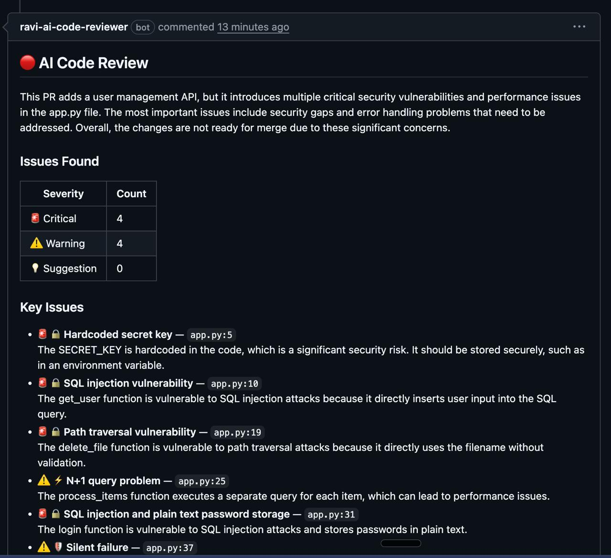
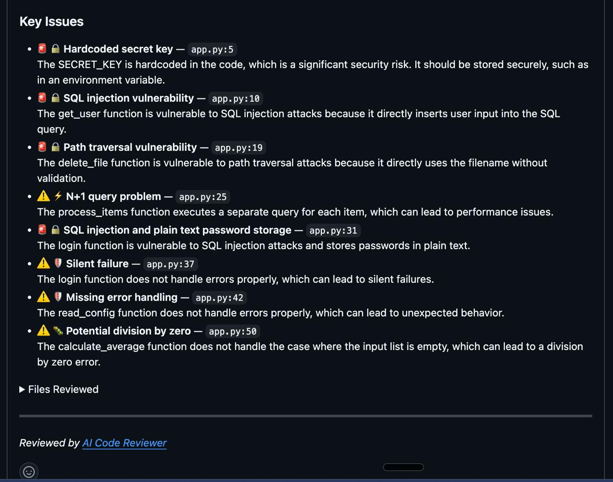
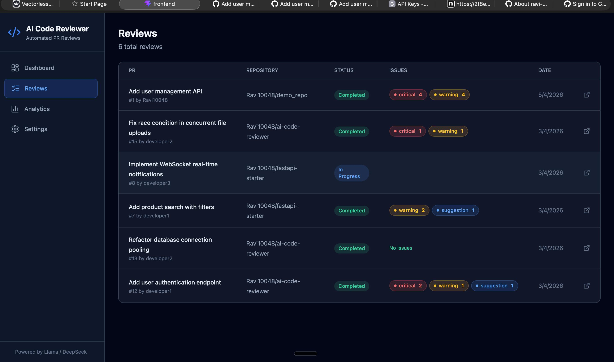
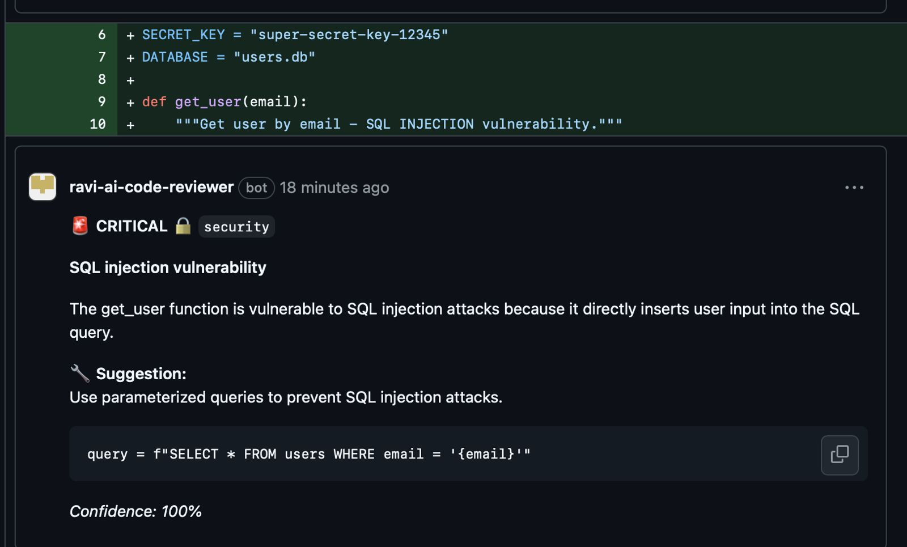
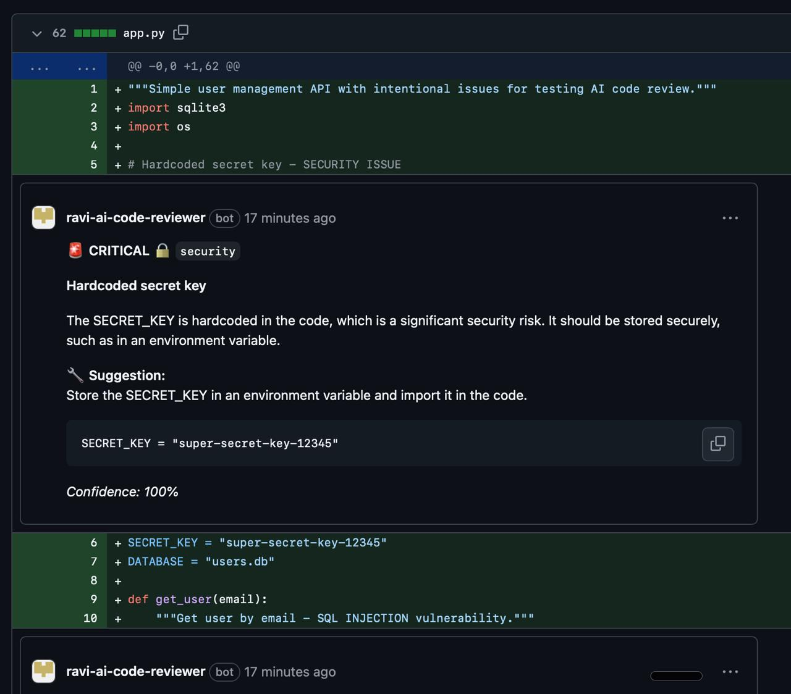

# AI Code Reviewer

AI-powered code review bot for GitHub Pull Requests. Installs as a GitHub App, automatically reviews PRs using open-source LLMs (Llama 3.3, DeepSeek), and posts inline comments with bug reports, security warnings, and improvement suggestions.

## Demo

### Bot automatically reviews PRs and posts comments


### Detailed issue breakdown with severity and suggestions


### Web dashboard to track all reviews


### Review detail with expandable issues



## How It Works

```
1. Developer opens a Pull Request
2. GitHub sends webhook to your server
3. Server fetches the PR diff
4. LLM (Llama 3.3 / DeepSeek) analyzes code file-by-file
5. Bot posts summary comment + inline comments on the PR
6. Review saved to database, visible on dashboard
```

```
┌──────────────┐     webhook      ┌─────────────────┐     LLM call     ┌──────────────┐
│   GitHub PR   │ ──────────────→ │  FastAPI Backend  │ ──────────────→ │  Groq / Ollama│
│   opened      │ ←────────────── │  (review engine)  │ ←────────────── │  (Llama 3.3)  │
└──────────────┘  review comments └────────┬──────────┘                 └──────────────┘
                                           │
                                    ┌──────▼──────┐
                                    │   SQLite DB   │
                                    │   (history)   │
                                    └──────┬──────┘
                                           │
                                    ┌──────▼──────┐
                                    │    React     │
                                    │  Dashboard   │
                                    └─────────────┘
```

## Code Flow (Step-by-Step)

This explains how a single PR review flows through the entire codebase, from webhook to GitHub comment.

### Step 1: GitHub Sends Webhook → `webhook/handler.py`
```
Developer opens PR on GitHub
  → GitHub sends POST /webhook/github with PR payload
  → FastAPI receives it in routers/webhook.py
  → Verifies signature (webhook/validator.py) using HMAC-SHA256
  → Routes to handle_pull_request_event()
  → Only triggers on: "opened", "synchronize", "reopened"
  → Responds immediately with {"status": "review_queued"}
  → Spawns background task: _run_review()
```

### Step 2: Authenticate with GitHub → `github/auth.py`
```
_run_review() needs to read the PR diff and post comments
  → Generates JWT token from App's private key (.pem file)
  → Exchanges JWT for installation access token (valid 1 hour)
  → Tokens are cached to avoid re-generating on every call
  → Returns authenticated PyGithub client
```

### Step 3: Fetch & Parse PR Diff → `github/diff_parser.py`
```
GitHubClient.get_pr_diff() fetches all changed files
  → For each file, reconstructs unified diff format
  → parse_diff() splits into FileDiff objects, each containing:
      - file_path, language, status (added/modified/deleted)
      - DiffHunk objects with line-by-line changes
      - Each DiffLine tracks: content, old_line_number, new_line_number, type
  → filter_reviewable_files() removes:
      - Lock files, minified JS, node_modules, binaries
      - Sorts by most changes first
      - Respects max_files_per_review limit
```

### Step 4: AI Review Engine → `review/engine.py`
```
ReviewEngine.review_pr() orchestrates the review:
  → For EACH file:
      1. Builds language-specific prompt (review/prompts.py)
         - System prompt: severity rules, categories, confidence threshold
         - File prompt: diff content + language-specific checks
         - Python: mutable defaults, missing await, bare except
         - JavaScript: == vs ===, missing await, XSS risks
      2. Sends to LLM via provider (llm/factory.py → groq or ollama)
      3. Parses JSON response into ReviewIssue objects
      4. Validates line numbers against actual diff (anti-hallucination)
      5. Filters issues below 70% confidence
  → After all files reviewed:
      - Generates PR-level summary via separate LLM call
      - Returns FullReviewResult with all issues + summary
```

### Step 5: LLM Provider Layer → `llm/groq_provider.py` or `llm/ollama_provider.py`
```
Factory pattern selects provider based on LLM_PROVIDER env var:
  → GroqProvider: calls Groq API (free, cloud-hosted Llama/DeepSeek)
      - Rate limiter: 28 requests/minute token bucket
      - Auto-retry with exponential backoff on rate limits
      - Structured JSON output via response_format
  → OllamaProvider: calls local Ollama server
      - No rate limits, full privacy
      - Configurable model and timeout (300s for slow models)
  → Both return standardized LLMResponse (content, tokens, model info)
```

### Step 6: Post Results to GitHub → `github/client.py`
```
Two types of comments posted:
  1. Summary Comment (PR-level):
     - Markdown table with severity counts
     - Key issues list with file:line references
     - Overall quality assessment (good/acceptable/needs_work/critical)
     - Posted via pr.create_issue_comment()

  2. Inline Comments (line-level):
     - Only for issues meeting min_severity threshold
     - Maps issue line_number → diff hunk (required by GitHub API)
     - Shows: severity badge, category, description, suggestion, code snippet
     - Posted via pr.create_review_comment() with exact line + commit SHA
```

### Step 7: Save to Database → `db/repository.py`
```
All results persisted to SQLite:
  → Review record: repo, PR number, title, author, status, duration, model used
  → Issue records: file, line, severity, category, description, confidence
  → Analytics queries: aggregated by severity, category, daily counts, top repos
  → Dashboard reads from these tables via REST API
```

### Step 8: Dashboard Displays Results → `frontend/`
```
React app calls /api/reviews, /api/analytics/summary:
  → Dashboard: stats cards (total reviews, issues, avg duration)
  → Reviews List: paginated table with severity badges
  → Review Detail: expandable issue cards grouped by file
  → Analytics: line chart (over time), pie chart (severity), bar chart (category)
  → Settings: switch LLM provider/model, configure thresholds
```

## Features

- **Automatic PR Reviews** — Triggered on PR open, push, or reopen
- **Inline Comments** — Line-level comments directly on the PR diff
- **Summary Reports** — Overall review with severity table and key issues
- **Multi-Model** — Groq (free cloud: Llama, DeepSeek, Mixtral) or Ollama (self-hosted)
- **Web Dashboard** — Review history, analytics charts, settings
- **Language-Aware** — Tailored prompts for Python, JavaScript, TypeScript, Java, Go
- **Configurable** — Severity thresholds, file limits, model selection via UI or `.codereview.yml`

## What It Detects

| Category | Examples |
|----------|----------|
| **Security** | SQL injection, hardcoded secrets, path traversal, XSS |
| **Bugs** | Null access, off-by-one, type mismatches, division by zero |
| **Performance** | N+1 queries, missing indexes, unnecessary loops |
| **Error Handling** | Missing try/catch, silent failures, unhandled promises |
| **Style** | Dead code, poor naming, overly complex expressions |

## Quick Start

### 1. Create a GitHub App

1. Go to **GitHub Settings → Developer Settings → GitHub Apps → New GitHub App**
2. Set:
   - **Webhook URL**: `https://your-server.com/webhook/github`
   - **Webhook Secret**: Generate a random string
   - **Permissions**: Pull Requests (Read & Write), Contents (Read), Metadata (Read)
   - **Events**: Pull Request
3. Generate a **Private Key** (downloads `.pem` file)
4. Note the **App ID**

### 2. Configure

```bash
git clone https://github.com/Ravi10048/ai-code-reviewer.git
cd ai-code-reviewer

cp .env.example .env
# Edit .env → set GITHUB_APP_ID, GITHUB_WEBHOOK_SECRET, GROQ_API_KEY

# Place your private key
cp ~/Downloads/your-app.private-key.pem ./github-app.pem
```

### 3. Run with Docker Compose

```bash
docker compose up -d

# Dashboard: http://localhost:3000
# API Docs:  http://localhost:8080/docs
```

### 4. Run Locally (Development)

```bash
# Backend
cd backend
python3 -m venv .venv && source .venv/bin/activate
pip install -r requirements.txt
uvicorn app.main:app --reload --port 8080

# Frontend (separate terminal)
cd frontend
npm install && npm run dev

# Tunnel for webhooks
ngrok http 8080
```

### 5. Install the App

Go to `https://github.com/apps/your-app-name` → Install on your repos → Open a PR → Bot reviews automatically!

## Configuration

### Environment Variables

| Variable | Required | Default | Description |
|----------|----------|---------|-------------|
| `GITHUB_APP_ID` | Yes | — | GitHub App ID |
| `GITHUB_PRIVATE_KEY_PATH` | Yes | `./github-app.pem` | Path to `.pem` file |
| `GITHUB_WEBHOOK_SECRET` | Yes | — | Webhook secret |
| `LLM_PROVIDER` | No | `groq` | `groq` or `ollama` |
| `GROQ_API_KEY` | If Groq | — | Free key from console.groq.com |
| `GROQ_MODEL` | No | `llama-3.3-70b-versatile` | Groq model |
| `OLLAMA_MODEL` | No | `deepseek-coder-v2` | Ollama model |

### Per-Repository Config

Add `.codereview.yml` to any repo:

```yaml
min_severity: warning
ignore:
  - "*.lock"
  - "dist/**"
categories:
  - bug
  - security
  - performance
max_files: 50
```

## Supported Models

| Provider | Models | Cost |
|----------|--------|------|
| **Groq** | Llama 3.3 70B, DeepSeek R1 70B, Mixtral 8x7B, Gemma 2 9B | Free |
| **Ollama** | DeepSeek Coder V2, Llama 3.1, CodeLlama, any compatible model | Free (local) |

## Tech Stack

| Layer | Technology |
|-------|-----------|
| **Backend** | Python, FastAPI, SQLAlchemy, SQLite |
| **Frontend** | React, TypeScript, Tailwind CSS, Recharts |
| **LLM** | Groq API (cloud), Ollama (self-hosted) |
| **GitHub** | PyGithub, JWT auth, Webhooks |
| **Deploy** | Docker Compose, Railway/Render |

## API Endpoints

| Method | Endpoint | Description |
|--------|----------|-------------|
| `POST` | `/webhook/github` | GitHub webhook receiver |
| `GET` | `/api/reviews` | List reviews (paginated) |
| `GET` | `/api/reviews/:id` | Review detail with issues |
| `GET` | `/api/analytics/summary` | Dashboard analytics |
| `GET` | `/api/analytics/repos` | Connected repositories |
| `GET/PUT` | `/api/settings` | App settings |
| `GET` | `/api/settings/health` | LLM health check |

## Project Structure

```
ai-code-reviewer/
├── backend/
│   ├── app/
│   │   ├── main.py              # FastAPI entry point
│   │   ├── config.py            # Settings (env vars)
│   │   ├── github/              # GitHub App auth, diff parser, comment poster
│   │   ├── llm/                 # Multi-provider LLM (Groq, Ollama, factory)
│   │   ├── review/              # Review engine, prompts, models
│   │   ├── webhook/             # Webhook handler, signature verification
│   │   ├── routers/             # API routes (reviews, analytics, settings)
│   │   └── db/                  # SQLAlchemy models, repository pattern
│   └── tests/                   # 18 unit tests
├── frontend/
│   ├── src/
│   │   ├── pages/               # Dashboard, Reviews, Analytics, Settings
│   │   ├── components/          # Sidebar, StatsCard, SeverityBadge
│   │   └── api/                 # API client
├── docker-compose.yml           # Backend + Frontend + Ollama
└── README.md
```

## License

MIT
